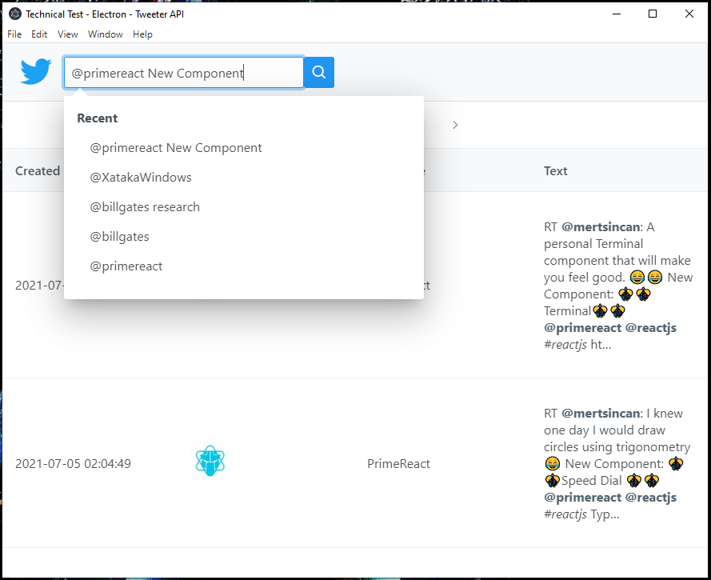

# Tweets searcher application
Example of an Electron application to search tweets.

Project is done using following technologies: 
* [Nodejs](https://nodejs.org/) 
* [React](https://reactjs.org/)
* [Electron](https://www.electronjs.org/)
* [Parcel](https://parceljs.org/)

## Usage of the application
The application allows you to do general searches or search for content of an specific user.


Example of searches:
Search value               | Description
-------------------------- | -------
windows                    | Performs a general search using the keyword "windows".
@billgates				   | Search tweets of user "billgates".
@billgates research        | Search tweets of user "billgates" containing the keyword "research".

The last 5 recent searches are saved to be used as a bookmark:



## Install prerequisites
- Install node.js: download and install setup from [node.js](https://nodejs.org/en/download/)

## Installation
* Do a GIT clone or download this source code and extract all files to a local folder.
* Open the command line, go to your directory previously created and run: ``` npm install ```

## Start the application in development mode
### Start the project as an Electron application:
* On the command line, run: ``` npm start ```

### Start the project as a web page:
* On the command line, run: ``` npm run standalone-start ```

## Package the application
### Package the project as an Electron application:
* On the command line, run: ``` npm run build ```

### Package the project as a web page:
* On the command line, run: ``` npm run standalone-build ```

## Structure of the source code
Path                       | Description
-------------------------- | -------
/                          | Root path. Here are the project configuration files.
/public/                   | Public folder. Here are the public files such as index.html, favicon.ico.
/src/                      | The main application source files are located here.
/src/components            | Here are the source files to define the components.
/src/models                | Here are the source files to define the data Transfer Objects (DTO).
/src/services              | Here are the source files to define the services.
/dist                      | Here are the compiled files prepared for distribution.

## Twitter consumer key
This application requires consumer keys to be able to use the Twitter REST API. 
This key is like your username. It is used to verify who you are to Twitter. 

The consumer keys are composed of two keys:
* API Key
* API Secret Key

If you want to generate your own keys, you will need to be registered on the [Twitter Developer portal](https://developer.twitter.com/en/portal/projects-and-apps)
and then create a Twitter application before. See more information [here](https://developer.twitter.com/en/docs/apps/overview) 

You are free to change the predefined keys of this code by changing constants "API_KEY" and "API_SECRET_KEY" of the file ```/src/services/twitter.service.ts```
